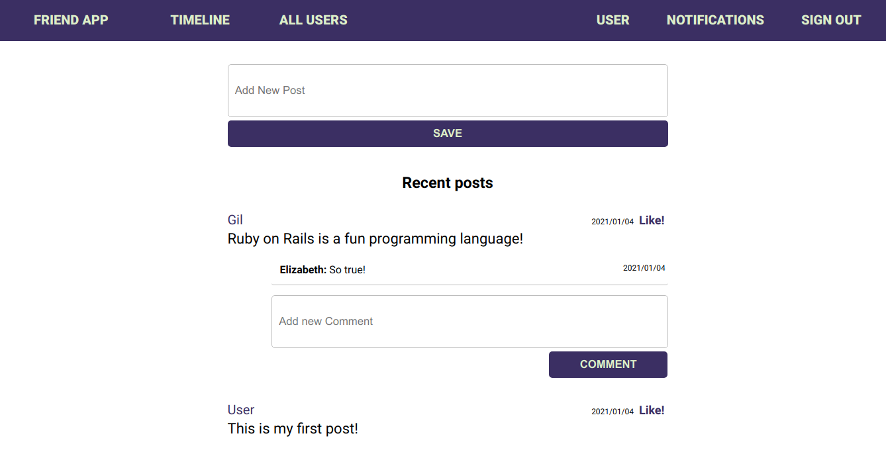
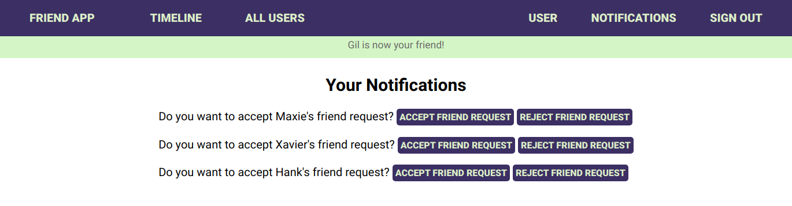

# Blog app: add API endpoints

> In this project we create API endpoints that allows user to interact with Social app. The user must be authenticated first.






## Built With

- Ruby v2.7.0
- Ruby on Rails v5.2.4

## Live Demo

[Link](https://frozen-everglades-42625.herokuapp.com/)

### Prerequisites

Ruby: 2.6.3
Rails: 5.2.3
Postgres: >=9.5

## Getting Started

To get a local copy up and running follow these simple example steps.
1. Open Terminal.
2. Navigate to your desired location to download the contents of this repository.
3. Clone this repository: ```git clone https://github.com/tnyandoro/blog_api.git```
4. Run ```cd blog_api```

### Setup

Instal gems with:

```
bundle install
```

Setup database with:

```
   rails db:create
   rails db:migrate
```


## Use

- Navigate to the root directory of the project
- Run `rails server`
- Open a browser and visit `127.0.0.1:3000`
- Sign in and create events!

## Testing

- Run Rspec 'rspec -f -d'

## API endpoints

### API endpoint to list all posts
  - http://localhost:3000/api/posts

### API endpoint to list all comments for a post
  - http://localhost:3000/api/posts/:post_id/comments

### API endpoint to add a comment to a post
  - http://localhost:3000/api/posts/:post_id/comments


## Authors

👤 **Donat UWAMAHORO**

- GitHub: [Donat Uwamahoro](https://github.com/uwadonat)
- Twitter: [Donat Uwamahoro](https://www.linkedin.com/in/uwadonat)
- LinkedIn: [Donat Uwamahoro](https://twitter.com/uwahoroDonat)

👤 **Tendai NYANDORO**

- GitHub: [@Tendai Nyandoro](https://github.com/tnyandoro)
- Twitter: [@tendai28](https://twitter.com/tendai28)
- LinkedIn: [Tendai Nyandoro](https://www.linkedin.com/in/tendai-nyandoro/)

👤 **Hubert MUGABO**

- GitHub: [Hubert MUGABO](https://github.com/mugberto)
- Twitter: [Hubert MUGABO](https://twitter.com/mugberto)
- LinkedIn: [Hubert MUGABO](https://www.linkedin.com/in/hubert-mugabo)

## 🤝 Contributing

Contributions, issues and feature requests are welcome!

Feel free to check the [issues page](https://github.com/newhorizon-tech/ror-social-scaffold/issues/).

## Show your support

Give a ⭐️ if you like this project!

## Acknowledgments

- The Odin Project
- The Rails Guides

## 📝 License

MIT License

